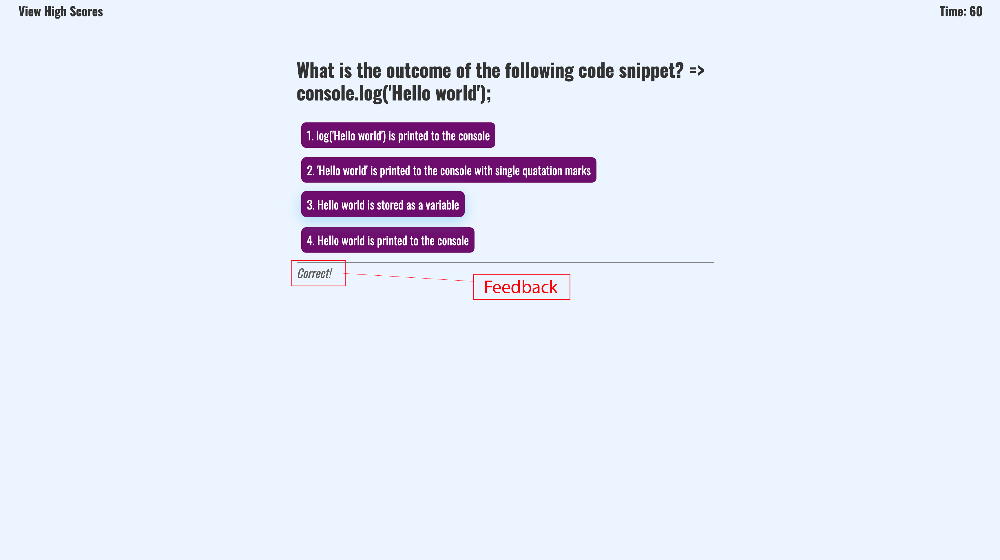

# JavaScript Coding Quiz

## This is a timed coding Quiz app which is build from scratch using HTML, CSS and JavaScript code. This app includes following features:

- upon pressing the start button the quiz begins and the timer count down start
- once the app started it ask questions to the user with 4 different options to choose the answer
- it shows the feedback to the user once the answer choice is made. Feedback show if the chosen answer is correct or wrong.
- ones the all the questions are completed or the times runs out the games stops and shows the score to the user and asks the user for their initials to store it at Local Storage
- once the user details is provided it will lead to the score page where user can see the previous user name and scores obtained.
- on the score page the app provided two option
  1. Go Back - to restart the game
  2. Clear saved scores - to clear the saved scores in local storage.

Below it the screen shots of the apps:

## Home Page

## Q&A Choice with countdown timer

## Feedback

## User Initials

## User Scores

## Links

Below is the link related to the project:

- Project Homepage: https://rochak-ms.github.io/JS-CodeQuiz/
- Repository: https://github.com/rochak-ms/JS-CodeQuiz

# Usage

To use this Website, you can review the codes in each section. For looking what changes is being made, open the Chrome DevTools by pressing Command+Option+I (macOS) or Control+Shift+I (Windows). A console panel should open either below or to the side of the webpage in the browser. There you will see comment have been added with the changes being made.

## Credits

- Youtube - Google - W3school.com

## License

- MIT License
